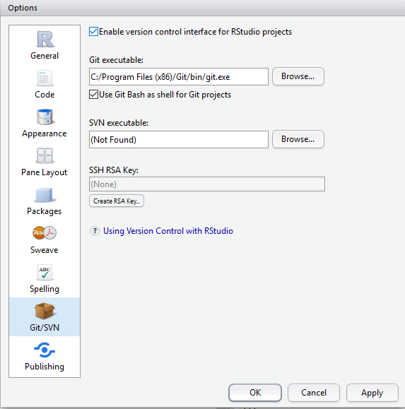
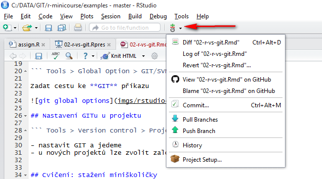

## Prostředí

Zopakujeme si co vlastně chceme

1. nainstalované R
2. nainstalované R studio
3. nainstalovaný GIT

Mají všichni?

## Nastavte si GITu globálně

``` Tools > Global Option > GIT/SVN ```



## Nastavte GIT u projektu

``` Tools > Version control > Project setup ```

- nastavit GIT a jedeme
- u nových projektů lze zvolit založení nového GITu
- R Studio pozná, že je projekt verzován a ukáže ikonu




## Cvičení: stažení miniškoličky

```git clone https://github.com/etnetera-activate/r-minicourse```

- nebo můžeme zkusit pomocí grafického rozhraní
- jakmile se stáhne otevřete si v R Studiu projekt **r-minicourse.proj**
- WOW, vidíte to samé co já
- pak stačí jednou za čas dát **git pull** a dostanete čerstvou verzi kódu
- chcete-li měnit založte si vlastní větev na lokále

Super!


