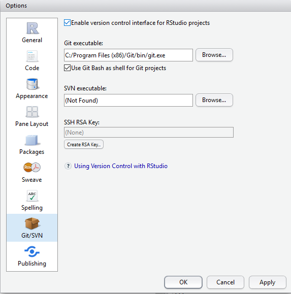

Rko a GIT
========================================================
author: Jiri Stepan
date: 21.09.2015

Prostøedí
========================================================
Zopakujeme si co vlastnì chceme

1. nainstalované R
2. nainstalované R studio
3. nainstalovaný GIT

Mají všichni?

Rozhození GITu Krok 1
========================================================

``` Tools > Global Option > GIT/SVN ```

Zadat cestu ke **GIT** pøíkazu



Nastavení GITu u projektu
========================================================
``` Tools > Version control > Project setup ```

- nastavit GIT a jedeme
- u nových projektù lze zvolit založení nového GITu


Cvièení: stažení miniškolièky
=============================

```git clone https://github.com/etnetera-activate/r-minicourse```

- nebo mùžeme zkusit pomocí grafického rozhraní
- jakmile se stáhne otevøete si v R Studiu projekt **examples/examples.proj**

Super!
