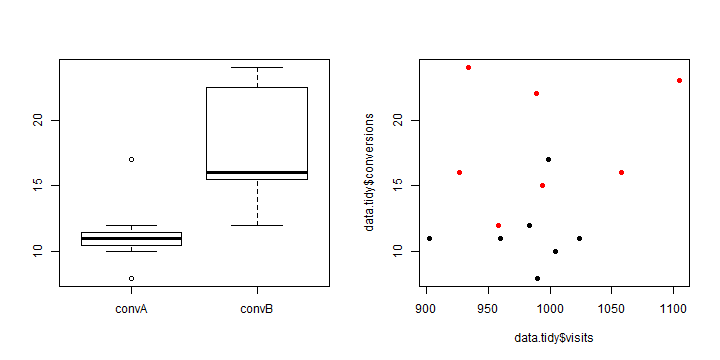

Fáze získání a čištění dat
--------------------------

Trvá většinou 80% času. Jejím cílem je získat čistá data pro následnou analýzu. Zahrnuje:
* samotné načtění dat z nějakého zdroje
* specifikace typů
* řešení chybějících dat a outlierů
* přejmenovávání a organizace proměných
* převod to tidy formátu

Celý proces musí být perfekně popsán a musí být opakovatelný!

---

Základní forma dat - tidy data
------------------------------

Abychom mohli data zpracovávavat v R, musíme je z RAW data dostat do formátu zvaného *Tidy data*. Což znamená.

* každý soubor obsahuje pozorování jednoho typu
* každý sloupen odpovídá jedné proměné a každá proměná je právě v jednom sloupci.
* každá řádka obsahuje hodnoty proměných pro jedno pozorování nebo `missing`

---

Toto nejsou tidy data
---------------------
Předpokládejme, že děláme AB test a vyhodnocujeme jej. Nagenerujeme si data pro sedm dnů.


```r
n <- 7
data <- as.data.frame(list(date = seq(as.Date("2012-01-01"), as.Date("2012-01-01") + 
    n - 1, by = "1 day"), visitsA = as.integer(rnorm(n = n, mean = 1000, sd = 50)), 
    convA = rbinom(n = n, size = 1000, prob = 0.01), visitsB = as.integer(rnorm(n = n, 
        mean = 1000, sd = 50)), convB = rbinom(n = n, size = 1000, prob = 0.02)))

data
```

```
##         date visitsA convA visitsB convB
## 1 2012-01-01     999    17     927    16
## 2 2012-01-02    1024    11    1058    16
## 3 2012-01-03     990     8     994    15
## 4 2012-01-04     983    12    1105    23
## 5 2012-01-05     960    11     958    12
## 6 2012-01-06     902    11     989    22
## 7 2012-01-07    1004    10     934    24
```


---

Toto jsou spravna data
----------------------
Abychom je ziskali, musime si je trochu upravit.


```r
tmpA <- melt(data = data[, c(1, 2, 3)], id = c("date", "visitsA"))
tmpB <- melt(data = data[, c(1, 4, 5)], id = c("date", "visitsB"))
tmpA <- rename(tmpA, c(visitsA = "visits", variable = "testgroup", value = "conversions"))
tmpB <- rename(tmpB, c(visitsB = "visits", variable = "testgroup", value = "conversions"))
data.tidy <- rbind(tmpA, tmpB)
head(data.tidy)
```

```
##         date visits testgroup conversions
## 1 2012-01-01    999     convA          17
## 2 2012-01-02   1024     convA          11
## 3 2012-01-03    990     convA           8
## 4 2012-01-04    983     convA          12
## 5 2012-01-05    960     convA          11
## 6 2012-01-06    902     convA          11
```


---
Takovýmto datům totiž Rko rozumí a počítá s nimi na vstupy


```r
par(mfcol = c(1, 2))
boxplot(data.tidy$conversions ~ data.tidy$testgroup)
plot(x = data.tidy$visits, y = data.tidy$conversions, pch = 19, col = as.numeric(data.tidy$testgroup))
```

 


---

A pro změnu agregace
--------------------
Abychom ale mohli udělat ověření AB testu musíme je agregovat, protože mne nezajímají datumy, ale celý soubor pro A, resp B.


```r
library(plyr)
data.aggregated <- ddply(data.tidy, .(testgroup), summarize, visits = sum(visits), 
    conversions = sum(conversions))
data.aggregated
```

```
##   testgroup visits conversions
## 1     convA   6862          80
## 2     convB   6965         128
```


---

A finalni test, zda B je opravdu lepsi


```r
test <- prop.test(x = data.aggregated$conversions, n = data.aggregated$visits, 
    alternative = "two.sided")
print(test)
```

```
## 
## 	2-sample test for equality of proportions with continuity
## 	correction
## 
## data:  data.aggregated$conversions out of data.aggregated$visits
## X-squared = 10.08, df = 1, p-value = 0.001496
## alternative hypothesis: two.sided
## 95 percent confidence interval:
##  -0.010914 -0.002525
## sample estimates:
##  prop 1  prop 2 
## 0.01166 0.01838
```


----

Pro zajimavost 
--------------
Toto je typicka struktura, ktera je vystupem statistickych funkci a modelu.


```r
str(test)
```

```
## List of 9
##  $ statistic  : Named num 10.1
##   ..- attr(*, "names")= chr "X-squared"
##  $ parameter  : Named num 1
##   ..- attr(*, "names")= chr "df"
##  $ p.value    : num 0.0015
##  $ estimate   : Named num [1:2] 0.0117 0.0184
##   ..- attr(*, "names")= chr [1:2] "prop 1" "prop 2"
##  $ null.value : NULL
##  $ conf.int   : atomic [1:2] -0.01091 -0.00252
##   ..- attr(*, "conf.level")= num 0.95
##  $ alternative: chr "two.sided"
##  $ method     : chr "2-sample test for equality of proportions with continuity correction"
##  $ data.name  : chr "data.aggregated$conversions out of data.aggregated$visits"
##  - attr(*, "class")= chr "htest"
```


.. ale zpět k datům

---

Import dat
----------
Nejčastější příklady:

* Libovolný soubor z disku nebo dostupný na internetu
* CSV pomocí `read.csv()`
* XML pomocí package `XML`
* JSON pomocí package `bjson`
* Google anlaytics pomocí package `rga`

---

Pracovní data
-------------

Interní objekty lze ukládat a nahrávat pomocí `load()` a `save()` do interní binární formy. Typicky slouží pro uložení vyčištěných a transformovaných dat.


```r
save(data.tidy, data.aggregated, file = "mydata.rda")
rm(list = ls())  #delete all objects
dim(data.tidy)
```

```
## Error: object 'data.tidy' not found
```


```r
load(file = "mydata.rda")
dim(data.tidy)
```

```
## [1] 14  4
```


---
Komplexnější příklad číštění dat
--------------------------------

Zkusíme si udělat analýzu rozvodovosti dle dat poskytovaných ČSÚ.

---

Další zajímavé packages
-----------------------

* `httr` - for working with http connections
* `RMySQL` - for interfacing with mySQL
* `RMogo` - acesing mongo
* `bigmemory` - for handling data larger than RAM
* `RHadoop` - for interfacing R and Hadoop (by Revolution Analytics)
* `foreign` - for getting data into R from SAS, SPSS, Octave, etc.
* `rJava` - accesing java objects
* ...
